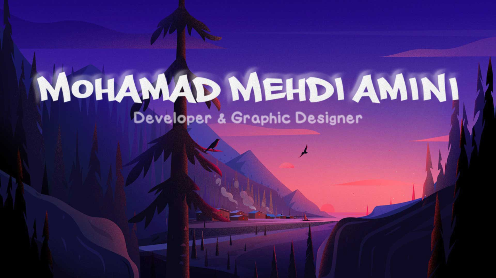

<!-- first session -->

<!-- ________________(^_^)_________________ -->

<!-- second session -->

- 💪 I love coding

- 🧑‍🏫 **lorem** bro

- Lorem

- Lorem

- Lorem

- Lorem

- Lorem

- Lorem

 <!-- ________________(^_^)_________________ -->
 
 <!-- Third session -->

 
  

